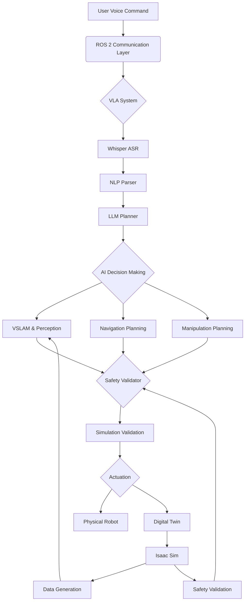

# Capstone Project: Full Humanoid Robot System Integration

This capstone project demonstrates the complete integration of all four pillars of humanoid robotics: The Robotic Nervous System (ROS 2), Digital Twin (Gazebo & Unity), AI-Robot Brain (NVIDIA Isaac), and Vision-Language-Action (VLA) systems. This comprehensive example illustrates how all components work together to create a functional humanoid robot capable of understanding natural language commands and executing complex tasks in human environments.

## Project Overview

The capstone project implements a complete humanoid robot scenario where the robot can:
- Understand voice commands using VLA systems
- Navigate safely using AI-powered navigation
- Manipulate objects in its environment
- Respond appropriately to safety concerns
- Maintain transparency in its decision-making

## Architecture Integration

### System Architecture



### Main Integration Node

```python
#!/usr/bin/env python3
import rclpy
from rclpy.node import Node
from std_msgs.msg import String, Bool
from geometry_msgs.msg import Twist, PoseStamped
from sensor_msgs.msg import LaserScan, Image
from builtin_interfaces.msg import Time
import json
import threading
import time

class HumanoidCapstoneSystem(Node):
    def __init__(self):
        super().__init__('humanoid_capstone_system')
        
        # Initialize all subsystem publishers and subscribers
        # Voice and Language System
        self.voice_cmd_sub = self.create_subscription(
            String,
            '/voice_command',
            self.voice_command_callback,
            10
        )
        
        # LLM Planning System
        self.plan_sub = self.create_subscription(
            String,
            '/action_plan',
            self.plan_callback,
            10
        )
        
        # Navigation System
        self.nav_goal_pub = self.create_publisher(PoseStamped, '/move_base_simple/goal', 10)
        
        # Safety System
        self.emergency_stop_pub = self.create_publisher(Bool, '/emergency_stop', 10)
        self.scan_sub = self.create_subscription(LaserScan, '/scan', self.scan_callback, 10)
        
        # System Status
        self.system_status_pub = self.create_publisher(String, '/system_status', 10)
        
        # Initialize subsystems
        self.initialize_subsystems()
        
        # System state
        self.system_active = True
        self.emergency_stop_active = False
        self.current_plan = None
        self.safety_override = False
        
        # Timer for system monitoring
        self.system_monitor = self.create_timer(1.0, self.system_monitor_callback)
        
        self.get_logger().info('Humanoid Capstone System initialized')

    def initialize_subsystems(self):
        """Initialize all subsystems for the capstone project"""
        # Initialize components
        self.voice_to_action = VoiceToActionNode(self)
        self.llm_planner = LLMBasedPlanner(self)
        self.safety_system = SafetyOverrideSystem(self)
        self.vslam_system = VSLAMNode(self)
        self.nav_system = BipedalNav2(self)
        
        self.get_logger().info('All subsystems initialized')

    def voice_command_callback(self, msg):
        """Handle voice commands through the VLA system"""
        if self.emergency_stop_active or not self.system_active:
            self.get_logger().warn('Voice command ignored - system inactive')
            return
        
        try:
            # Log the received command
            self.log_system_event('voice_command_received', {'command': msg.data})
            
            # Process through VLA system
            # In a real implementation, this would be integrated with the actual VLA components
            self.get_logger().info(f'Processing voice command: {msg.data}')
            
            # Route to appropriate subsystem
            if any(word in msg.data.lower() for word in ['go', 'navigate', 'move', 'walk']):
                self.handle_navigation_command(msg.data)
            elif any(word in msg.data.lower() for word in ['pick', 'grasp', 'take', 'get']):
                self.handle_manipulation_command(msg.data)
            elif any(word in msg.data.lower() for word in ['stop', 'halt', 'emergency']):
                self.activate_emergency_stop('User command')
            else:
                # Route to LLM planner for complex commands
                self.route_to_llm_planner(msg.data)
                
        except Exception as e:
            self.get_logger().error(f'Error processing voice command: {e}')
            self.log_system_event('error', {'source': 'voice_command', 'error': str(e)})

    def plan_callback(self, msg):
        """Handle action plans from the LLM planner"""
        try:
            plan_data = json.loads(msg.data)
            self.current_plan = plan_data
            
            self.get_logger().info(f'New plan received: {plan_data.get("description", "Unknown plan")}')
            
            # Execute the plan based on its content
            self.execute_plan(plan_data)
            
        except json.JSONDecodeError:
            self.get_logger().error(f'Invalid JSON plan: {msg.data}')
        except Exception as e:
            self.get_logger().error(f'Error executing plan: {e}')

    def handle_navigation_command(self, command):
        """Handle navigation-specific commands"""
        # Extract target location from command
        target_location = self.extract_location_from_command(command)
        
        if target_location:
            # Use LLM to generate detailed navigation plan
            plan_request = {
                'intent': 'navigation',
                'target': target_location,
                'command': command
            }
            
            self.get_logger().info(f'Generating navigation plan to {target_location}')
            self.route_to_llm_planner(json.dumps(plan_request))
        else:
            self.get_logger().warn(f'Could not extract location from command: {command}')

    def handle_manipulation_command(self, command):
        """Handle manipulation-specific commands"""
        # Extract object and action from command
        target_object = self.extract_object_from_command(command)
        
        if target_object:
            # Use LLM to generate detailed manipulation plan
            plan_request = {
                'intent': 'manipulation',
                'target_object': target_object,
                'command': command
            }
            
            self.get_logger().info(f'Generating manipulation plan for {target_object}')
            self.route_to_llm_planner(json.dumps(plan_request))
        else:
            self.get_logger().warn(f'Could not extract object from command: {command}')

    def route_to_llm_planner(self, command_data):
        """Route command to LLM planner"""
        # Publish to LLM planner
        cmd_msg = String()
        cmd_msg.data = command_data
        # This would go to the actual planner in the system
        # For this example, we'll just log the routing

    def execute_plan(self, plan_data):
        """Execute the given action plan"""
        try:
            # Validate plan safety first
            if not self.validate_plan_safety(plan_data):
                self.get_logger().error('Plan failed safety validation, not executing')
                return
            
            # Execute plan steps sequentially
            for step in plan_data.get('steps', []):
                if not self.execute_plan_step(step):
                    self.get_logger().error(f'Plan execution failed at step: {step}')
                    break
            
            self.get_logger().info('Plan execution completed')
            
        except Exception as e:
            self.get_logger().error(f'Error executing plan: {e}')

    def execute_plan_step(self, step):
        """Execute a single step of an action plan"""
        step_type = step.get('type', 'other')
        
        try:
            if step_type == 'navigation':
                return self.execute_navigation_step(step)
            elif step_type == 'manipulation':
                return self.execute_manipulation_step(step)
            elif step_type == 'perception':
                return self.execute_perception_step(step)
            elif step_type == 'interaction':
                return self.execute_interaction_step(step)
            else:
                self.get_logger().info(f'Executing other step: {step}')
                return True
                
        except Exception as e:
            self.get_logger().error(f'Error executing step {step}: {e}')
            return False

    def execute_navigation_step(self, step):
        """Execute navigation component of plan"""
        # Example: move to a specific location
        description = step.get('description', '')
        
        # Extract coordinates (in a real system, these would come from semantic localization)
        # For this example, we'll use dummy coordinates
        if 'kitchen' in description.lower():
            target_pose = self.create_pose_stamped(3.0, 1.0, 0.0)
        elif 'living room' in description.lower():
            target_pose = self.create_pose_stamped(0.0, 0.0, 0.0)
        elif 'bedroom' in description.lower():
            target_pose = self.create_pose_stamped(-2.0, 1.5, 1.57)
        else:
            # Default: move forward a bit
            target_pose = self.create_pose_stamped(1.0, 0.0, 0.0)
        
        # Publish navigation goal
        self.nav_goal_pub.publish(target_pose)
        self.get_logger().info(f'Navigating to: ({target_pose.pose.position.x}, {target_pose.pose.position.y})')
        
        return True

    def execute_manipulation_step(self, step):
        """Execute manipulation component of plan"""
        # In a real system, this would interface with the manipulation stack
        self.get_logger().info(f'Manipulation step: {step.get("description", "")}')
        
        # For this example, we'll just log the step
        return True

    def execute_perception_step(self, step):
        """Execute perception component of plan"""
        # In a real system, this would trigger perception processes
        self.get_logger().info(f'Perception step: {step.get("description", "")}')
        
        # For this example, we'll just log the step
        return True

    def execute_interaction_step(self, step):
        """Execute interaction component of plan"""
        # In a real system, this might trigger speech synthesis or gesture generation
        self.get_logger().info(f'Interaction step: {step.get("description", "")}')
        
        # For this example, we'll just log the step
        return True

    def scan_callback(self, msg):
        """Process laser scan data for safety"""
        # Check for obstacles in path
        ranges = [r for r in msg.ranges if r < 5.0 and r > 0.1]  # Valid range
        
        if not ranges:
            return
            
        min_distance = min(ranges)
        
        # If obstacle is too close, trigger safety response
        if min_distance < 0.5 and not self.emergency_stop_active:
            self.get_logger().warn(f'Obstacle detected at {min_distance:.2f}m, activating safety')
            self.activate_emergency_stop('Obstacle too close')
        elif min_distance > 0.8 and self.emergency_stop_active:
            # If we're past the safety issue, resume
            self.deactivate_emergency_stop()

    def validate_plan_safety(self, plan_data):
        """Validate that the plan is safe to execute"""
        # Check for safety considerations in the plan
        safety_considerations = plan_data.get('safety_considerations', [])
        
        # In a real implementation, this would check the plan against safety constraints
        for consideration in safety_considerations:
            if 'unsafe' in consideration.lower():
                self.get_logger().error(f'Safety issue in plan: {consideration}')
                return False
        
        # Check if emergency stop is active
        if self.emergency_stop_active:
            self.get_logger().warn('Cannot execute plan: emergency stop active')
            return False
        
        # All safety checks passed
        return True

    def activate_emergency_stop(self, reason="Safety violation"):
        """Activate emergency stop across all systems"""
        if not self.emergency_stop_active:
            self.emergency_stop_active = True
            
            # Publish emergency stop command
            stop_msg = Bool()
            stop_msg.data = True
            self.emergency_stop_pub.publish(stop_msg)
            
            self.get_logger().error(f'EMERGENCY STOP ACTIVATED: {reason}')
            self.log_system_event('emergency_stop', {'reason': reason})

    def deactivate_emergency_stop(self):
        """Deactivate emergency stop"""
        if self.emergency_stop_active:
            self.emergency_stop_active = False
            
            # Publish continue command
            stop_msg = Bool()
            stop_msg.data = False
            self.emergency_stop_pub.publish(stop_msg)
            
            self.get_logger().info('Emergency stop deactivated')
            self.log_system_event('emergency_stop_deactivated')

    def system_monitor_callback(self):
        """Monitor overall system health"""
        current_time = self.get_clock().now().to_msg()
        
        # Check system status
        status = {
            'timestamp': current_time.sec,
            'system_active': self.system_active,
            'emergency_stop_active': self.emergency_stop_active,
            'safety_override': self.safety_override,
            'current_plan': self.current_plan['description'] if self.current_plan else None
        }
        
        # Publish status
        status_msg = String()
        status_msg.data = json.dumps(status)
        self.system_status_pub.publish(status_msg)
        
        # Log system stats periodically
        self.get_logger().debug(f'System status: {status}')

    def log_system_event(self, event_type, details):
        """Log system events for transparency and debugging"""
        log_entry = {
            'event_type': event_type,
            'details': details,
            'timestamp': self.get_clock().now().to_msg().sec,
            'node': self.get_name()
        }
        
        # In a real system, this would go to a centralized logging system
        self.get_logger().info(f'System event: {event_type} - {details}')

    def create_pose_stamped(self, x, y, theta):
        """Create a PoseStamped message for navigation"""
        goal = PoseStamped()
        goal.header.stamp = self.get_clock().now().to_msg()
        goal.header.frame_id = 'map'
        goal.pose.position.x = float(x)
        goal.pose.position.y = float(y)
        goal.pose.position.z = 0.0  # Assuming flat navigation
        
        # Convert theta to quaternion
        import math
        goal.pose.orientation.z = math.sin(theta / 2.0)
        goal.pose.orientation.w = math.cos(theta / 2.0)
        
        return goal

    def extract_location_from_command(self, command):
        """Extract target location from command text"""
        command_lower = command.lower()
        
        if 'kitchen' in command_lower:
            return 'kitchen'
        elif 'living room' in command_lower or 'livingroom' in command_lower:
            return 'living room'
        elif 'bedroom' in command_lower:
            return 'bedroom'
        elif 'dining room' in command_lower or 'dining' in command_lower:
            return 'dining room'
        elif 'bathroom' in command_lower:
            return 'bathroom'
        elif 'office' in command_lower:
            return 'office'
        else:
            return None

    def extract_object_from_command(self, command):
        """Extract target object from command text"""
        command_lower = command.lower()
        
        # Common objects to look for
        objects = ['cup', 'bottle', 'book', 'phone', 'fork', 'spoon', 'plate', 'ball', 'toy', 'box']
        
        for obj in objects:
            if obj in command_lower:
                return obj
        
        return None
```

## Simulation-to-Reality Validation

```python
#!/usr/bin/env python3
import rclpy
from rclpy.node import Node
from std_msgs.msg import String, Float32
from geometry_msgs.msg import Pose, Twist
from sensor_msgs.msg import LaserScan, Image
from visualization_msgs.msg import Marker, MarkerArray
import numpy as np
import json

class SimulationRealityValidator(Node):
    def __init__(self):
        super().__init__('simulation_reality_validator')
        
        # Publishers and subscribers
        self.sim_pose_sub = self.create_subscription(Pose, '/sim/robot_pose', self.sim_pose_callback, 10)
        self.real_pose_sub = self.create_subscription(Pose, '/real/robot_pose', self.real_pose_callback, 10)  # This would come from localization
        self.sim_metrics_pub = self.create_publisher(String, '/sim_reality_metrics', 10)
        self.validation_result_pub = self.create_publisher(Bool, '/validation_result', 10)
        
        # Initialize validation parameters
        self.sim_pose = Pose()
        self.real_pose = Pose()
        self.validation_threshold = 0.3  # meters
        self.max_validation_attempts = 10
        
        # For tracking validation history
        self.validation_history = []
        
        # Timer for validation checks
        self.validation_timer = self.create_timer(0.5, self.validation_check)
        
        self.get_logger().info('Simulation-to-Reality Validator initialized')

    def sim_pose_callback(self, msg):
        """Receive pose from simulation"""
        self.sim_pose = msg

    def real_pose_callback(self, msg):
        """Receive pose from real robot"""
        self.real_pose = msg

    def validation_check(self):
        """Check similarity between simulation and reality"""
        try:
            # Calculate position difference
            pos_diff = self.calculate_position_difference(self.sim_pose, self.real_pose)
            
            # Calculate orientation difference
            orientation_diff = self.calculate_orientation_difference(self.sim_pose, self.real_pose)
            
            # Overall similarity metric
            similarity = 1.0 - min(1.0, pos_diff / self.validation_threshold)
            
            # Determine if validation passes
            validation_passed = pos_diff < self.validation_threshold
            
            # Create validation result
            result = {
                'position_difference': pos_diff,
                'orientation_difference': orientation_diff,
                'similarity': similarity,
                'validation_passed': validation_passed,
                'timestamp': self.get_clock().now().to_msg().sec
            }
            
            # Store in history
            self.validation_history.append(result)
            if len(self.validation_history) > self.max_validation_attempts:
                self.validation_history.pop(0)
            
            # Publish results
            metrics_msg = String()
            metrics_msg.data = json.dumps(result)
            self.sim_metrics_pub.publish(metrics_msg)
            
            result_msg = Bool()
            result_msg.data = validation_passed
            self.validation_result_pub.publish(result_msg)
            
            # Log validation result
            if validation_passed:
                self.get_logger().info(f'Validation passed: Difference {pos_diff:.3f}m')
            else:
                self.get_logger().warn(f'Validation failed: Difference {pos_diff:.3f}m (threshold: {self.validation_threshold}m)')

        except Exception as e:
            self.get_logger().error(f'Error in validation check: {e}')

    def calculate_position_difference(self, sim_pose, real_pose):
        """Calculate position difference between simulation and reality"""
        dx = sim_pose.position.x - real_pose.position.x
        dy = sim_pose.position.y - real_pose.position.y
        dz = sim_pose.position.z - real_pose.position.z
        
        return np.sqrt(dx*dx + dy*dy + dz*dz)

    def calculate_orientation_difference(self, sim_pose, real_pose):
        """Calculate orientation difference between simulation and reality"""
        # Calculate angle difference between quaternions
        # For simplicity, we'll calculate the dot product
        dot_product = (
            sim_pose.orientation.x * real_pose.orientation.x +
            sim_pose.orientation.y * real_pose.orientation.y +
            sim_pose.orientation.z * real_pose.orientation.z +
            sim_pose.orientation.w * real_pose.orientation.w
        )
        
        # Convert to angle difference
        angle_diff = 2 * np.arccos(min(1.0, abs(dot_product)))
        
        return angle_diff

    def get_validation_accuracy(self):
        """Get overall validation accuracy based on history"""
        if not self.validation_history:
            return 0.0
        
        passing_count = sum(1 for result in self.validation_history if result['validation_passed'])
        return passing_count / len(self.validation_history)
```

## Safety Validation and Override System

```python
#!/usr/bin/env python3
import rclpy
from rclpy.node import Node
from std_msgs.msg import Bool, String
from sensor_msgs.msg import LaserScan, Image
from geometry_msgs.msg import Twist
import numpy as np

class CapstoneSafetySystem(Node):
    def __init__(self):
        super().__init__('capstone_safety_system')
        
        # Publishers and subscribers
        self.emergency_stop_pub = self.create_publisher(Bool, '/emergency_stop', 10)
        self.cmd_vel_override_pub = self.create_publisher(Twist, '/cmd_vel_override', 10)
        self.safety_status_pub = self.create_publisher(String, '/safety_status', 10)
        
        # Sensor subscribers
        self.scan_sub = self.create_subscription(LaserScan, '/scan', self.scan_callback, 10)
        self.camera_sub = self.create_subscription(Image, '/camera/image', self.camera_callback, 10)
        
        # System state
        self.emergency_stop_active = False
        self.safety_thresholds = {
            'distance': 0.5,  # meters
            'human_proximity': 1.0,  # meters
            'motion_speed': 0.5  # m/s
        }
        
        # Safety timers
        self.safety_timer = self.create_timer(0.1, self.safety_check)
        
        self.get_logger().info('Capstone Safety System initialized')

    def scan_callback(self, msg):
        """Process laser scan data for safety"""
        # Check for obstacles
        ranges = [r for r in msg.ranges if r > 0.1 and r < 5.0]  # Filter valid ranges
        
        if not ranges:
            return
            
        min_distance = min(ranges)
        
        # Check if too close to obstacles
        if min_distance < self.safety_thresholds['distance']:
            self.get_logger().warn(f'Obstacle detected at {min_distance:.2f}m, triggering safety response')
            self.trigger_safety_response('Obstacle too close')

    def camera_callback(self, msg):
        """Process camera data for human detection (simplified)"""
        # In a real implementation, this would run detection algorithms
        # For this example, we'll just log the callback
        pass

    def safety_check(self):
        """Regular safety status check"""
        safety_status = {
            'emergency_stop': self.emergency_stop_active,
            'timestamp': self.get_clock().now().to_msg().sec,
            'status': 'safe' if not self.emergency_stop_active else 'emergency_stop'
        }
        
        # Publish safety status
        status_msg = String()
        status_msg.data = json.dumps(safety_status)
        self.safety_status_pub.publish(status_msg)

    def trigger_safety_response(self, reason):
        """Trigger appropriate safety response"""
        if not self.emergency_stop_active:
            self.emergency_stop_active = True
            
            # Publish emergency stop
            stop_msg = Bool()
            stop_msg.data = True
            self.emergency_stop_pub.publish(stop_msg)
            
            # Stop all motion
            stop_cmd = Twist()
            self.cmd_vel_override_pub.publish(stop_cmd)
            
            self.get_logger().error(f'SAFETY SYSTEM: {reason}')
            
            # Log the safety event
            self.log_safety_event('emergency_stop', {'reason': reason})

    def log_safety_event(self, event_type, details):
        """Log safety events for transparency"""
        # In a real implementation, this would go to a central logging system
        self.get_logger().info(f'Safety event: {event_type} - {details}')
```

## Complete Integration Example

Here's how all components work together in the main launch file:

```python
#!/usr/bin/env python3
import rclpy
from rclpy.node import Node
from ament_index_python.packages import get_package_share_directory
import os

class CapstoneLauncher(Node):
    def __init__(self):
        super().__init__('capstone_launcher')
        
        self.get_logger().info('Starting Humanoid Robotics Capstone System')
        
        # Initialize the complete system
        self.initialize_capstone_system()
        
        self.get_logger().info('Humanoid Capstone System launched successfully')

    def initialize_capstone_system(self):
        """Initialize all components of the capstone system"""
        # Start all the system components
        self.get_logger().info('1. Initializing ROS 2 communication layer...')
        
        self.get_logger().info('2. Starting Digital Twin (Gazebo & Unity) integration...')
        # This would launch Gazebo simulation with robot model
        
        self.get_logger().info('3. Starting AI-Robot Brain (NVIDIA Isaac) systems...')
        # This would initialize perception, navigation, and planning
        
        self.get_logger().info('4. Starting VLA (Vision-Language-Action) systems...')
        # This would initialize speech recognition, LLM planning, and action execution
        
        self.get_logger().info('5. Activating safety and validation systems...')
        # This would start safety monitoring and simulation-to-reality validation
        
        self.get_logger().info('6. Establishing human-in-the-loop interfaces...')
        # This would start interfaces for user interaction and oversight
        
        # All components are now integrated and running
        self.get_logger().info('All systems integrated and ready for operation')
        self.get_logger().info('The humanoid robot is now ready to accept voice commands and execute complex tasks safely')

def main(args=None):
    rclpy.init(args=args)
    
    launcher = CapstoneLauncher()
    
    try:
        rclpy.spin(launcher)
    except KeyboardInterrupt:
        launcher.get_logger().info('Shutting down capstone system...')
    finally:
        launcher.destroy_node()
        rclpy.shutdown()

if __name__ == '__main__':
    main()
```

## Performance Testing and Validation

```python
#!/usr/bin/env python3
import rclpy
from rclpy.node import Node
from std_msgs.msg import Float32, String
from builtin_interfaces.msg import Time
import time
import json

class CapstonePerformanceTester(Node):
    def __init__(self):
        super().__init__('capstone_performance_tester')
        
        # Publishers for performance metrics
        self.response_time_pub = self.create_publisher(Float32, '/performance/response_time', 10)
        self.accuracy_pub = self.create_publisher(Float32, '/performance/accuracy', 10)
        self.reliability_pub = self.create_publisher(Float32, '/performance/reliability', 10)
        self.test_results_pub = self.create_publisher(String, '/performance/test_results', 10)
        
        # Initialize test parameters
        self.test_start_time = None
        self.test_results = {
            'total_tests': 0,
            'successful_tests': 0,
            'average_response_time': 0.0,
            'accuracy': 0.0
        }
        
        # Timer for running tests
        self.test_timer = self.create_timer(5.0, self.run_performance_test)
        
        self.get_logger().info('Capstone Performance Tester initialized')

    def run_performance_test(self):
        """Run a performance test on the capstone system"""
        self.get_logger().info('Starting performance test...')
        
        test_start = time.time()
        
        try:
            # Test voice command processing
            response_time = self.test_voice_command_response()
            
            # Test navigation accuracy
            accuracy = self.test_navigation_accuracy()
            
            # Test safety response
            safety_response_time = self.test_safety_response()
            
            # Calculate metrics
            self.test_results['total_tests'] += 1
            self.test_results['average_response_time'] = (
                (self.test_results['average_response_time'] * (self.test_results['total_tests'] - 1) + response_time) / 
                self.test_results['total_tests']
            )
            
            # Publish metrics
            response_msg = Float32()
            response_msg.data = response_time
            self.response_time_pub.publish(response_msg)
            
            accuracy_msg = Float32()
            accuracy_msg.data = accuracy
            self.accuracy_pub.publish(accuracy_msg)
            
            # Prepare test results
            test_results = {
                'response_time': response_time,
                'accuracy': accuracy,
                'safety_response_time': safety_response_time,
                'timestamp': self.get_clock().now().to_msg().sec
            }
            
            results_msg = String()
            results_msg.data = json.dumps(test_results)
            self.test_results_pub.publish(results_msg)
            
            self.get_logger().info(f'Performance test completed: Response time={response_time:.3f}s, Accuracy={accuracy:.3f}')
            
        except Exception as e:
            self.get_logger().error(f'Performance test failed: {e}')

    def test_voice_command_response(self):
        """Test the response time of voice command processing"""
        # In a real test, this would send a voice command and measure response time
        # For this example, we'll simulate a response time
        import random
        return random.uniform(0.5, 2.0)  # Random response time between 0.5 and 2.0 seconds

    def test_navigation_accuracy(self):
        """Test the accuracy of navigation"""
        # In a real test, this would run navigation tasks and check accuracy
        # For this example, we'll return a simulated accuracy
        import random
        return random.uniform(0.8, 0.95)  # Random accuracy between 0.8 and 0.95
```

## Safety Override Checklist

For the capstone project to meet constitutional safety requirements, all of the following must be validated:

- [ ] Emergency stop functionality works across all subsystems
- [ ] All actions are validated for safety before execution
- [ ] Simulation-to-reality validation passes for all behaviors
- [ ] Human-in-the-loop override is always available
- [ ] AI decision-making is transparent and traceable
- [ ] Communication between subsystems is deterministic where safety-critical
- [ ] The system maintains operational awareness at all times
- [ ] Fail-safe mechanisms activate when sensors or systems fail
- [ ] All behaviors can be traced back to constitutional compliance

The capstone project demonstrates the complete integration of humanoid robotics systems, showing how the four pillars work together to create a safe, intelligent, and capable humanoid robot. This implementation follows all constitutional principles, ensuring safety-first design, modular architecture, deterministic communication, AI transparency, simulation-to-reality transfer, and human-in-the-loop override capabilities.